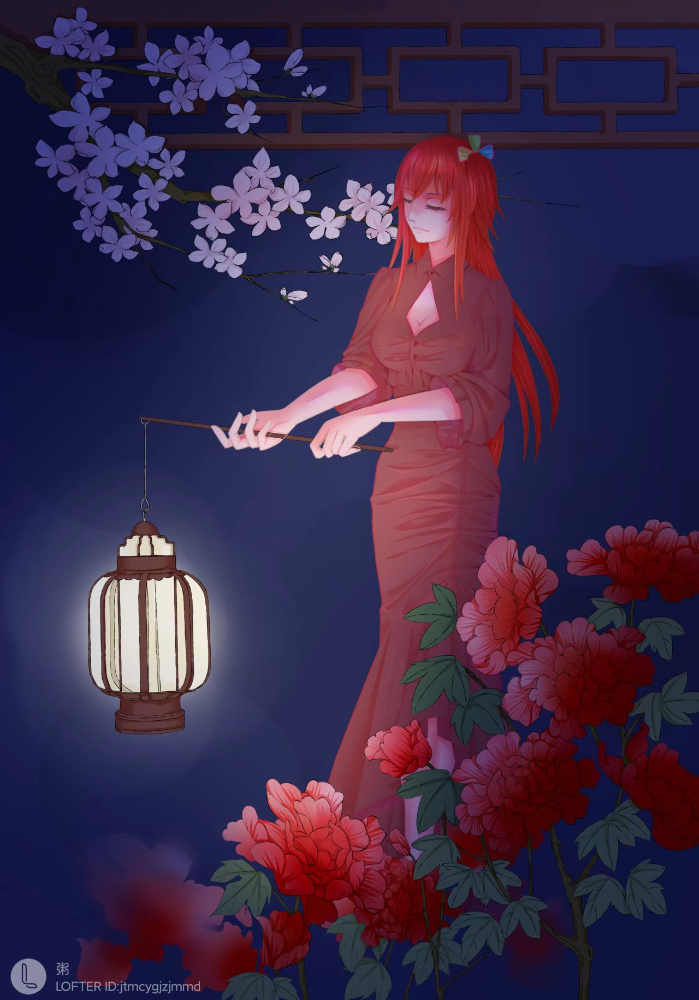

乔乔，来自北京东城区的一所高中，现在在物理学院就读，关于自己的大学生活，乔乔说，可能真正称得上是有印象的生活是从自己大二加入学生会开始的。之前大一的日子更像一些遥远的印象。

高考结束被科大录取的时候，乔乔就已经做好了心理准备，“在当时就知道自己不会在大学里面表现得特别突出，因为我的高中并不是一个竞赛氛围很重的学校，我也没有学过竞赛，只有旁听过一两节课的化学竞赛的课程”，来到科大之后，情况比她的预期还要更加不好，困难的课程和繁重的作业让她感到有些无所适从，在之后面对期末考试的时候，哪怕自己努力复习，成绩也很不理想，慢慢的，虽然乔乔依旧会努力，但最后也觉得自己在科大会平凡的度过大学四年，在那个时候她觉得或许不给自己设定一个很需要卷的目标，在读书的同时发展自己的兴趣爱好，多多参与学生活动，这样的生活算的上是另一种惬意，没有春风得意马蹄疾一日看遍长安花的激昂，但也能在自己的一片天地中舒服的迎接第二天的到来。

到了大二，由于之前加入过志愿者协会且工作能力突出，乔乔进入了物理学院学生会，担任学生会外宣工作，因为自己很喜欢绘画和平面设计。在她看来，进入学生会相当于带她进入了一段和之前完全不同的时光，因为在学生会朝夕相处的人都很优秀，而且都很热情。他们和乔乔聊得很来，平时也会力所能及的帮乔乔的忙。慢慢的随着和学生会的同事来往的越来越多，在身边人的影响下，一个想法开始在乔乔的心中萌芽，或许我努努力也可以像他们一样，够到保研线，过一个热烈而精彩的生活。这样，带着极大的热情，乔乔开始了大二的学习和生活。

乔乔的摸鱼作品
 

现实总是不会太尽如人意，与工作热情一道而来的还有学生会不断的设计图，与学习理想共同造访的还有难度逐渐加大的课程和作业，周末的时间大部分在和作业以及学生工作斗争，少数可以用作慰藉的是和学生会的朋友一起出去吃饭玩耍，逐渐增加的压力在期中考这一个需要一个学生挤出大量时间来复习的时候让她的心态出现了一丝裂缝，她开始感到力不从心，明明有很多值得追求的兴趣爱好和学习上可以努力达到的成绩，但自己似乎没有那么多时间和力气去实现它们了，而且兴趣和学习已经成为不可调和的两个部分，不论自己将精力花在哪个部分，总是需要在任务没有很好完成的情况下迅速调转方向，去弥补另一块的漏洞。随着熬的夜不断增多，课程作业越来越难以应付，期末考试临近了。

在期末考试之前制定复习计划的时候，乔乔有了一个大致的计划，希望在复习之后能够获得一个不错的成绩，这样自己开学时所立下的信念也算能够有所回应，而且大一下几门课程成功突破班平这件事给了她信心。或许在旁人看来这个理由和她这个学期的所有经历都算是微末而不足道的，但这些平凡的事情，加上身边朋友的影响，成为了期末周的精神支持。最早到来的考试是复变函数，一门计算和推导都很硬核的课，乔乔不止看了书本和笔记，回顾了一遍知识点，还刷了不少的课外题目，但即便如此，最后成绩出来依旧算不上好看，更加令人手忙脚乱的是，科大因为防疫要求，提前了一周所有的考试，原本吃紧的复习计划就更难以完成了，最后到考倒数第二门课理论力学的时候，乔乔已经感觉心力交瘁了。

理论力学，这门在物理学院大二所有课程中难的独树一帜的存在，很难在期末短时间内通过突击复习取得可观的进度。在理论力学考试前一天晚上，乔乔失眠了，考试的压力比以往任何时候都要大，因为在复习、应试、挫折这些之上还加上了自己的希望和未来规划的重量。一场难度爆炸的考试加上没有任何状态的应试，结果可想而知。在考完后，乔乔用笔来戳自己，用拳头砸墙，借此发泄情绪，但第二天还有电子线路的考试，最后一门了，她只能小心翼翼的收拾好自己的心情，晚上在物质楼自习室通宵看电子线路的书，到了第二天忍着头疼去对付这最后一门考试。

寒假成绩出来了，学生会的群里同级的人都在聊着自己的分数和等第，乔乔没有敢发言，因为自己的分数多少有点不太合群，她也没有想到，身边的这群好朋友给她带来的学习热情和对未来的展望，会在一个破碎不堪的学期后变得这么沉重，但有趣的是，当被问到大学感觉最开心或者说最温暖的的事情，乔乔说，可能还是和学生会的人相遇吧，虽然被这群人影响而产生的小小的愿望没有实现，但至少自己也努力过，大二上这个学期虽然很累但也心甘情愿。

至于现在和将来，乔乔和大多数同龄人一样，没有想好该做出怎样的选择，是去坚持自己的理想，继续基础学科的学习，还是说更现实一点，考虑去转金融或者cs，在乔乔看来，她可能还是会选择一条和大二相似的路，或许接受自己的不完美，但会去努力奋斗，结果如何或许没那么重要，毕竟在平凡的生活中，平凡的人也可以有不平凡的挣扎。