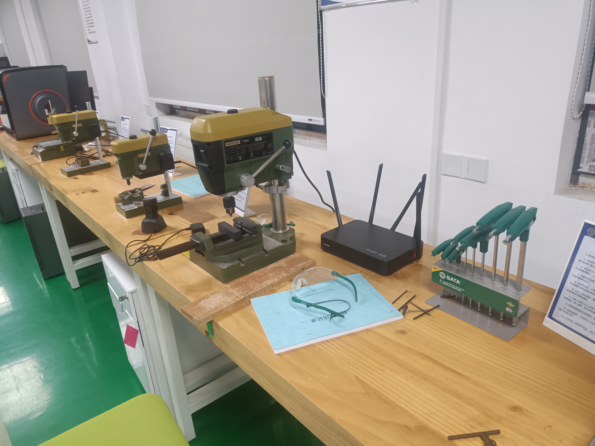
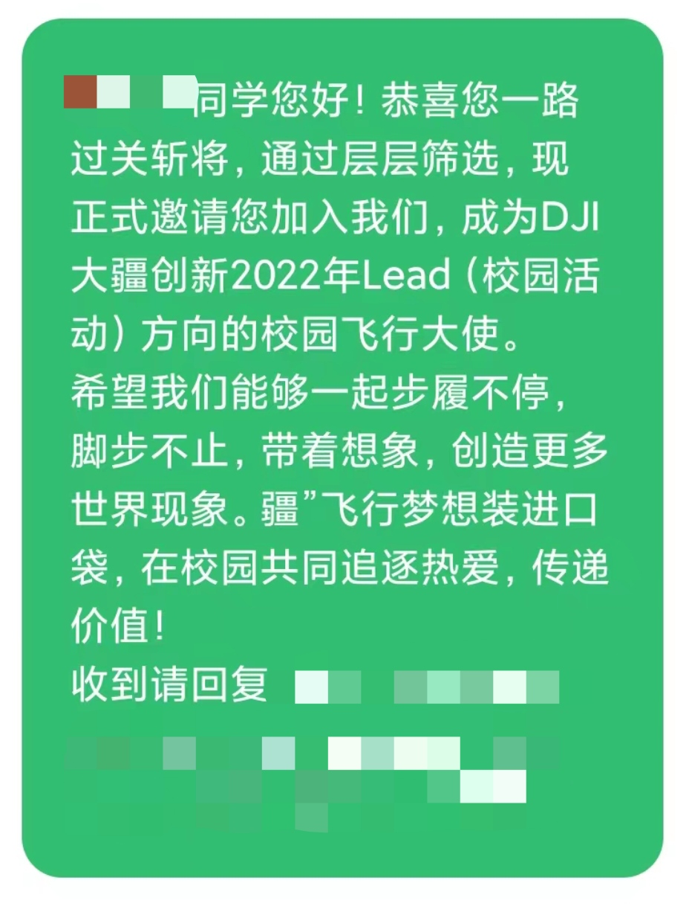

“未来，我想去一家企业文化与我的思想观念相符的私企，做一名懂技术的管理人员。”来自某院的大一学生小宇认真地说。

在此之前，小宇一直苦苦探寻着真正属于自己的人生方向。高中时的他，把科大看做信仰，认为只有来科大读书，才算不枉度此生。可近一年的大学生活，并没有如他预期那样，有更多的自由度，去学自己热爱的东西，反而带来了更大的压力与限制，甚至是心理上的摧残。

也许是因为沿袭了中学时“靠出人头地的成绩换取安全感”的惯性思维，或是周围有太多成绩优异的同学，小宇的评判标准不由自主地往成绩方面靠拢。他不住的感觉如果自己继续成绩平平下去，就会真的很差劲。每当和家长打电话，提及学习成绩，小宇的内心都隐隐作痛。

沉浸在“没学好”的痛苦之中，却又似乎没有足够的动力去学习，小宇不禁怀疑：“是不是高考考差一点，处境会比现在更好。”当年作为第一志愿的科大某院，愈发像是“这十几年的人生中做出过最错误的决定”。

在小宇看来，科大希望把同学们培养成科教报国的研究型人才，因此在对学生职业发展的引导上有所欠缺。在某种程度上来讲，科研与生产实际存在一定脱节，需要的技能也是不同的。对科研兴趣不是十分浓厚的小宇，希望得到一些就业方面的专业技能培训，以及对市场前景的介绍。

来到科大，仿佛进了一个企业文化和自己完全不符的公司。小宇不认为单凭数学和物理可以造就一个完整的人。

经过一学期的沉淀与反复思考，小宇对自我发展的规划明晰了不少。他决定一手抓学习成绩——尽量保研，同时也为了满足学校对社团负责人的绩点要求，以便继续为热爱的协会效力；另一方面则是探索自己职业方面的兴趣：蹭一蹭面向研究生的职业分享会、参加更多的活动、认识更多的朋友、与不同的思想相互碰撞、向有经验的学长学姐们请教求职的问题；除此之外，小宇还将会更深入地自学一些在工作中更为实用的知识，比如代码、人工智能等，为了成为一名合格的“懂技术的管理者”，小宇也要抽时间去旁听一些管院的课程。

 

小宇计划从大二下学期开始，向感兴趣的公司投递简历，来充实自己的实习经历。机器人比赛里，小宇和室友组了一个队。准备一起去参加。

对于保研，小宇的态度是暂且把它当做小目标。虽然不喜欢这种评价机制，但在现有条件下稍微的去适应一下，保研成功自然可喜，但失败也不可惜，唯一的执念可能就是如果没有保研，自己高考时在同龄人中所具有的优势没有体现出来。但不是这方面不好，就不能在其他方面好。小宇认为如果保研失败，自己就着手准备就业，而不是再花费一年的时间去考研。虽然小宇的家人认为读完研究生之后，更容易找到工作。但小宇相信用来读研究生的这几年，在社会职场里也能学到丰富的知识。

小宇还探索出一些适合自己的战术性质的“存活策略”：他选择留在竞争较弱的某院，以提高自己保研的可能性；由于老师的讲课方式可能不适合自己，他选择有PPT的课程，方便自己自学。总之，小宇的学业也随着他逐渐放下的忧虑和日益明确的目标慢慢走上正轨。

小宇有两所心仪的公司——小米和大疆。对智能驾驶感兴趣的小宇，讲起小米汽车智能驾驶和大疆正在做的智能驾驶系统时，十分的兴奋。

大疆邀请短信
 

提到工作后的生活，小宇说，他并不喜欢“码农”的生活状态，过多的榨干自己的青春的价值，把鲜活的人变成大公司前进路上的一个小齿轮。他希望工作以后能多跟人交流，有自己的空间。在这方面，小宇这学期的英语交流老师给了他一些启发——

老师正是在一家私企工作，有不错的职位。由于是兼职，老师这个学期只带一个班。老师讲他常去印度出差，做一些设计工作。在小宇心目中，科大的英语老师大多都给人一种自信阳光开朗的感觉，他们的状态正是自己以后想成为的样子。