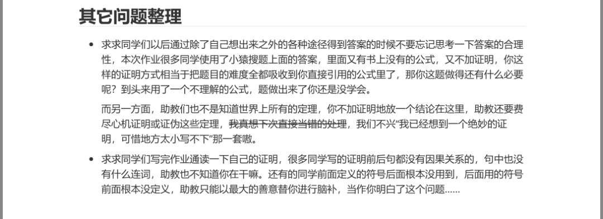

在科大的两年里，小光的生活充实快乐。在假日周末，会与友人一起探索校外美食；平时课下，她常常在校园里帮助猫协工作、统计数据、还在风雨中救助过巴掌大的幼猫；学校里举办的音乐节活动，如果有时间有心情，也会去欣赏。而学业上的迷茫，也随着一年前从计科转院到生医，消减了许多。

小光不属于信竞大佬，和我们大多数人一样，在中学期间没有了解过计算机究竟是学什么的，也没接触过编程。只是计算机属于大家口中的赚钱学科，刚好能选，于是就选选看，选择了计科。她也曾听说过，计算机工作很累、也比较难。但她认为自己应该不属于那种工作会非常肝而影响健康的人，只要像高中，上课认真听课，课下做作业、刷刷题，应该就能学会。但没想到，她的大学学习生活与她预想的完全不一样。

小光第一学期只有一门编程课──程序设计，其他全是数理基础。数学分析对曾经只学过高中知识的小光来说已经不算轻松，但物理课中一开始便需要用到许多高数知识，很快小光便吃不消，到后面就算努力听也完全听不懂课，也不会写作业。而程序设计也让小光很吃力：老师上课就对着ppt念一下语法，课后助教出的实验题却不是简单的应用，还带点脑筋急转弯似的算法。既要给问题想出程序化的解决方法，又要准确无误写出精准的代码，这让小光感到头疼。写出来执行有误，也不知道到底是哪个环节出了差错。同学虽然愿意回答问题，但也只能提供思路，没法手把手解决问题。小光说：“感觉老师课上对着图片讲，「这个这样写是什么意思」，我并没有学会，我觉得编程是一件很天马行空的事情。出了问题也看不出究竟怎么回事，只会一直看、一直想，还想不清楚。”课内云里雾里，作业题又十分吃力，一个学期后，小光的编程课成绩并不理想，也并不快乐。她开始思考，自己是不是不适合这个专业。

其实小光中学时一直对生物和医学专业心有向往，高考填志愿时其他学校大多填的生或医，而唯独在科大填了计算机。因为科大的生物并不属于学校强项，医学更是刚开始有，不知道到底怎么样。因此，小光还想着试一试，看看努力一下能不能补回来，便在第二学期继续学习了计科的课程。

但大一下的课更让小光难受了，仍是课上一脸懵、好像不知道该如何去学。代数结构是小光在计科最难受的课，这门课是那个学期她所上的挂科率最高的一门课──以15%遥遥领先其他课程。小光在这门课上非常不适应：老师手写板书小，但教室中又有200多同学。听课感受非常不好。课上也仅仅是将书上的内容抄了一遍，但书中错误太多了，到考试周了小光也完全不知道该如何突击，书上概念和作业题目都很难。这让小光非常痛苦，于是在大一结束的全校转专业中，小光转到了生医，宁愿起点低一点，比别人晚开始一年，也要跑路。

学不会的代数结构
 

“现在的学习感觉比在计科好多了，它更形象：课上讲的东西，我通过实验就能很清楚地看到。染个色、制个片，甚至解剖实验上还能掰开看。不那么容易失败，就算失败了，也可以看同学的、看制作好的标准片。”小光如此评价。

在她看来，生医的课程比计科更形象，课上讲的道理，可能再过几节课就能自己去看看。只要想学，就能学，不像之前那样，找不对方法，就完全做不到。

现在的小光仍然认为逃到生医是一个非常正确的决定，转院后的学习更和她高中熟悉的学习类似，她感觉学到了更多，也更快乐。考试周来临时也不再那么手足无措。小光还说，生医的同学在课程群里比计科的同学沉默许多，打开群便可以看见老师助教的安排、任务的布置；不像以前那样，群里常常开始“水”起来，冗长的聊天记录里既有很多与课程无关的聊天，也有大佬们对难题的讨论、对更难的作业的诉求，这些都使小光看得身心疲惫。氛围更加宁静与舒适。

但另一方面，现在已经本科过半的小光仍然在为数学物理课伤脑筋。这些课程既让她感到困难而花时间，又让她不明白，究竟为什么不能花更多时间在自己希望学习的领域里。小光告诉我，在大二上学完概统后，大二下有一门必修课叫“生物统计学”，难度更低，与医学联系更紧密，并且即使没有概统基础也能听懂。而关于光学，小光认为，医学工作者其实并不需要了解光的原理，只需要拍个片、能分析。她认为这些“数理基础”，完全可以改为“医学+光学讲座”一类的课程，这样才能让学习生医的同学们真正了解到更多。

谈到未来，小光说自己准备尽早参加生医组织的去医院轮班。她仍希望像中学时所想那样，做一位医生。“我准备先做一位医生，或许经历了许多轮班后，我会突然对某种疾病产生兴趣，转行去做科研，努力攻克它”，小光这样说。